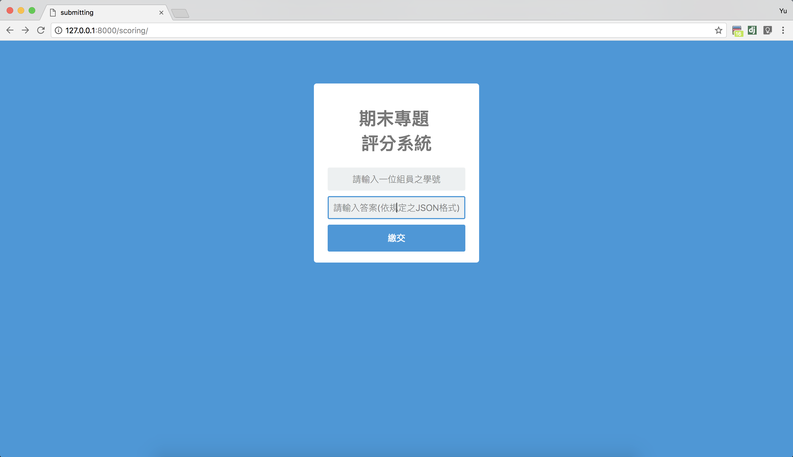

## 期末專題說明
- `questions_example.json`為提供測試之20題範例，其他題目皆以此邏輯出題。
- 答案繳交系統網址：http://140.120.13.243:5439/scoring/
- 目前系統供測試範例題目之得分，一題為5分。
- demo當天共**200題**，一題**0.5分**，限時**5分鐘**。

### 答案繳交系統使用注意事項
- 第一格填入一位組員之**學號**，第二格填入你程式跑出的**答案**
- 答案請使用規定之JSON格式，例如: 第一題答案**A**，第二題答案**B**，第三題答案**C**，JSON格式應為 ["**A**", "**B**", "**C**"]
- 請確認自己程式輸出之答案，**demo當天格式須符合規定，系統才能正確計算分數。**


### 可用資源
1. 中文wiki百科的json檔： https://drive.google.com/open?id=0ByoB_9NkZ9rRa3VUY25TeXRtdnM
2. 繁體中文wiki的json檔，且content經過斷詞：https://drive.google.com/file/d/0ByoB_9NkZ9rRZWFRa1FiWlZYTDA/view?usp=sharing  
3. ptt社群網站爬蟲：https://github.com/UDICatNCHU/ptt-web-crawler
4. ijson: https://github.com/isagalaev/ijson
   使用ijson搜尋工具，ijson主要是使用在json過大而不能夠全部loading進記憶體時，採用stream的方式讀取json檔。
	python3 ijsonSearch.py 查詢的json檔名 查詢的目標類型 查詢目標名稱

### JSON讀取說明
- 例如題目之格式為：
```json
 {"Question":"中華民國第14任總統，民主進步黨第16屆黨主席，同時也是台灣歷史上首位女性元首，她是:" 
  , "A":"蔡正元"
  , "B":"蔡英文"
  , "C":"洪慈庸" },

  {"Question":"明末清初著名軍事將領，曾因「引清兵入關」而被世人斥責為漢奸，他的名字叫做:" 
  , "A":"吳一桂"
  , "B":"吳二桂"
  , "C":"吳三桂" }
```
- 使用`open`函式讀檔，並用`json.load`讀取json檔:
```python
import json

with open('questions.json', 'r') as f:
  json_list = json.load(f)
```

- 選擇**第一題的題目**的方法如下:
```python
print(json_list[0]['Question'])
```
- 列印結果:
```
中華民國第14任總統，民主進步黨第16屆黨主席，同時也是台灣歷史上首位女性元首，她是:
```
